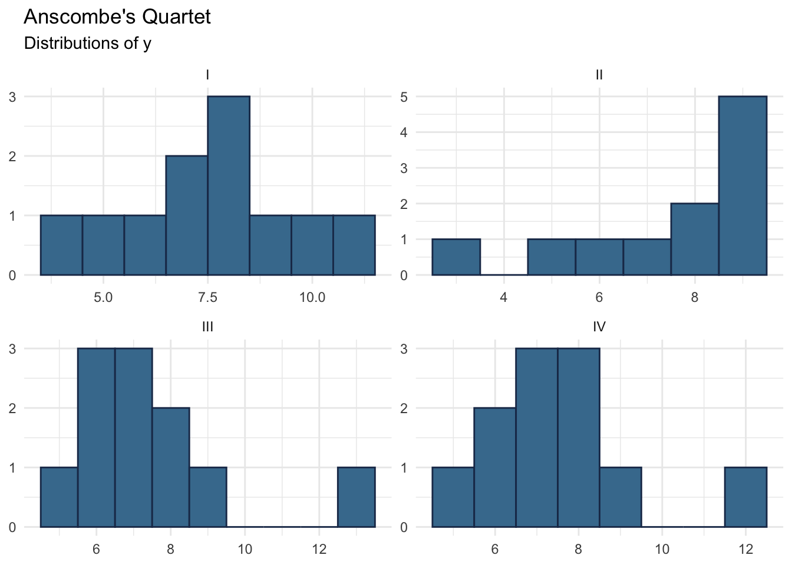
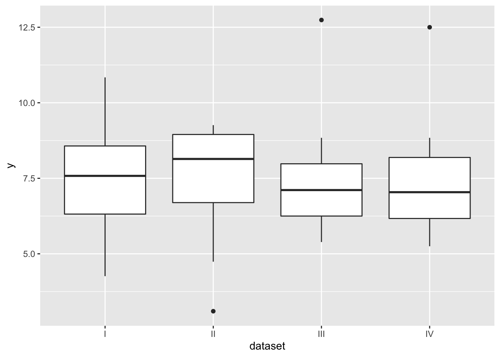
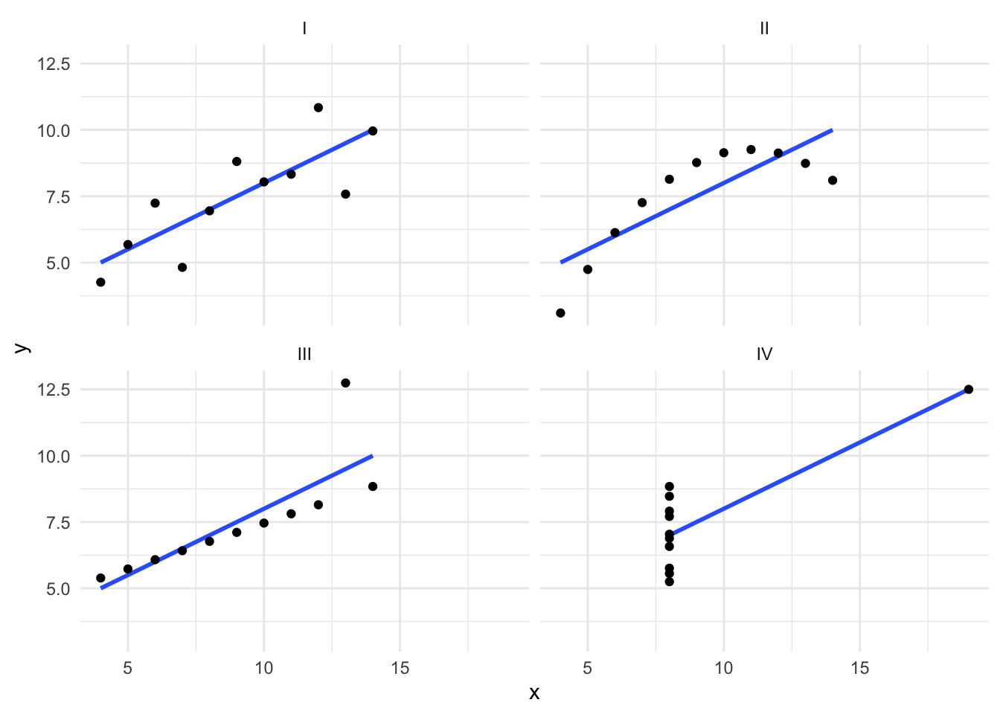
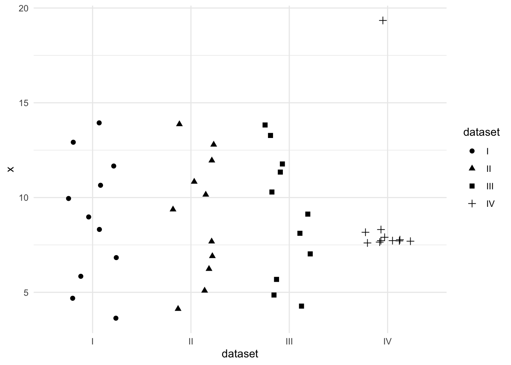

# Data Visualization {#data-viz}

](assets/images/ggplot2_exploratory.png)

## Learning Objectives

After completing this lab, you should be able to do the following:

* Install and load R packages.
* Understand why data visualization is a useful tool for science communication.
* Know and apply the APA guidelines for figures in APA manuscripts.
* Understand the basic "grammar of graphics" used by `ggplot2`.
* Apply the basic "grammar of graphics" to visualize data in R.

## Prepare for the Lab

Ensure that you are comfortable with the content in labs 1 and 2.

## Lab Activity

Use the [anscombe_long.csv](assets/data/anscombe_long.csv) data for this lab activity.

### Setup

1. If you haven't already, install `ggplot2`.
2. Load `ggplot2`.
3. Import [anscombe_long.csv](assets/data/anscombe_long.csv) into R as a `data.frame` named `anscombe_long`.
4. Convert `anscombe_long$dataset` to a factor with levels: 1 = "I", 2 = "II", 3 = "III", and 4 = "IV".

### Plots

Write a script to produce each of the following plots. All of them use the [anscombe_long.csv](assets/data/anscombe_long.csv) data.

### Plot 1: Histograms

### Plot 2: Boxplot

### Plot 3: Scatter Plot

### Plot 4: Jitter Plot

#### Tips for Recreating Plot 4 {-}

Identify the aesthetic mappings before you start.

* Which variable is mapped to x?
* Which is mapped to y?
* Are there any other aesthetic mappings?

Use `geom_jitter()` to plot the points. `geom_jitter()` is a variant of `geom_point()` that adds a small amount of random variation to the placement of the points. It's useful when points would otherwise be overlapping. Note that the jitter is random, so your plot will not match this one exactly. The jitter can also affect the range of the scale axes.

Set the width of `geom_jitter()` to be equal to 0.25.

This plot uses `theme_minimal()`. You are free to use whatever theme you prefer.

<!-- ## Resources -->

<!-- [Data Visualization Slides](assets/slides/03-data-visualisation-slides.pdf) -->
